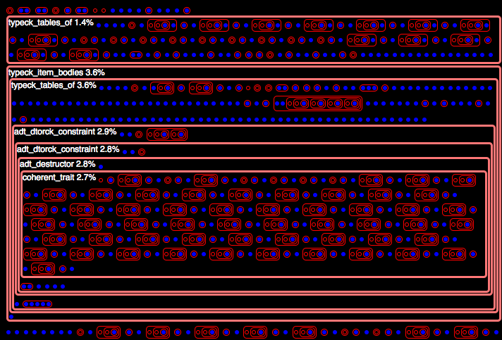

# Profiling Queries

In an effort to support _incremental compilation_, the latest design of
the Rust compiler consists of a _query-based_ model.

The details of this model are (currently) outside the scope of this
document, however, we explain
[some background of this model](#background), in an effort to explain
how we profile its performance. We intend this profiling effort to address
[issue 42678](https://github.com/rust-lang/rust/issues/42678).

## Quick Start

### 1. Compile `rustc`
Compile the compiler, as usual:

```
python x.py --stage 1
```

### 2. Run `rustc`, with flags
Run the compiler on a source file, supplying two additional debugging flags with `-Z`:

```
rustc -Z profile-queries -Z dump-dep-graph foo.rs
```

Regarding the two additional parameters:

- `-Z profile-queries` tells the compiler to run a separate thread
  that profiles the queries made by the main compiler thread(s).
- `-Z dump-dep-graph` tells the compiler to "dump" various files that
  describe the compilation dependencies.

This command will generate the following files:

- `profile_queries.html` consists of an HTML-based representation of
  the [trace of queries](#trace-of-queries).
- `profile_queries.counts.txt` consists of a histogram, where each histogram "bucket" is a query provider.

### 3. Inspect the output
3(a). Open the HTML file (`profile_queries.html`) with a browser.  See [this section](#interpret-the-html-output) for an explanation of this file.

3(b). Open the data file (`profile_queries.counts.txt`) with a text editor, or spreadsheet.  See [this section](#interpret-the-data-output) for an explanation of this file.

3(c). Older stuff, also generated as output (you can _ignore these files_; we won't discuss them further here):

- `dep_graph.dot` consists of old stuff: a representation of dependencies that are _outside_ the newer query model.
- `dep_graph.txt` consists of old stuff: a representation of dependencies that are _outside_ the newer query model.


## Interpret the HTML Output

### Example 0

The following image gives some example output, from tracing the
queries of `hello_world.rs` (a single `main` function, that prints
`"hello world"` via the macro `println!`).  This image only shows a
short prefix of the total output; the _actual_ output is much longer.



[Full HTML output](profile-queries/example0/profile_queries.html)

### Example 0 explanation

The trace of the queries has a formal structure; see
[Trace of Queries](#trace-of-queries) for details.

We style this formal structure as follows:

- Blue dots represent query hits.  They consist of leaves in the
  trace's tree. (CSS class: `hit`).
- Red boxes represent query misses. They consist of internal nodes in
  the trace's tree. (CSS class: `miss`).
- Many red boxes contain _nested boxes and dots_.  This nesting structure
  reflects that some providers _depend on_ results from other
  providers, which consist of their nested children.  
	 - For example, the red box labeled as `typeck_tables_of` depends
	   on the one labeled `adt_dtorck_constraint`, which itself
	   depends on one labeled `coherent_trait`.
- Some red boxes are _labeled_ with text, and have highlighted borders
  (light red, and bolded).  (See [heuristics](#heuristics) for
  details).  Where they are present, the labels give the following
  information:
     - The [query's _provider_](#queries), sans its _key_ and its _result_,
       which are often too long to include in these labels.
     - The _duration_ of the provider, as a fraction of the total time
       (for the entire trace). This fraction includes the query's
       entire extent (that is, the sum total of all of its
       sub-queries).


## Heuristics

Heuristics-based CSS Classes:

- `important` -- Trace nodes are `important` if they have an extent of
  6 (or more), _or_ they have a duration fraction of one percent (or
  more).  These numbers are simple hueristics (currently hard-coded,
  but easy to modify).  Important nodes are styled with textual
  labels, and highlighted borders (light red, and bolded).

## Interpret the Data Output

The file `profile_queries.counts.txt` contains a table of information
about the queries, organized around their providers.

For each provider, we produce:

- A total **count** --- the total number of times this provider was
  queried

- A total **duration** --- the total number of seconds spent running
  this provider, _including_ all providers it may depend on.  To get a
  sense of this dependency structure, and inspect a more fine-grained
  view of these durations, see
  [this section](#interpret-the-html-output).

These rows are **sorted by total duration**, in descending order.

### Counts: Example 0

The following example `profile_queries.counts.txt` file results from
running on a hello world program (a single main function that uses
`println` to print `"hellow world").

As explained above, the columns consist of `provider`, `count`, `duration`:

```
symbol_name,2441,0.362
def_symbol_name,2414,0.129
item_attrs,5300,0.060
type_of,4841,0.059
generics_of,7216,0.049
impl_trait_ref,2898,0.037
def_span,20381,0.030
adt_def,1142,0.028
is_foreign_item,2425,0.021
adt_dtorck_constraint,2,0.016
typeck_tables_of,33,0.014
typeck_item_bodies,1,0.010
coherent_trait,7,0.008
adt_destructor,10,0.008
borrowck,4,0.008
mir_validated,4,0.007
impl_parent,306,0.003
trait_def,216,0.001
mir_const,2,0.001
optimized_mir,6,0.000
adt_sized_constraint,9,0.000
predicates_of,82,0.000
privacy_access_levels,5,0.000
impl_polarity,15,0.000
trait_of_item,7,0.000
region_maps,11,0.000
associated_item_def_ids,7,0.000
super_predicates_of,8,0.000
variances_of,12,0.000
crate_inherent_impls,1,0.000
is_exported_symbol,2,0.000
associated_item,3,0.000
crate_inherent_impls_overlap_check,1,0.000
reachable_set,1,0.000
is_mir_available,1,0.000
inherent_impls,1,0.000
```

# Background

We give some background about the query model of the Rust compiler.

## Def IDs

In the query model, many queries have a key that consists of a Def ID.
The Rust compiler uses Def IDs to distinguish definitions in the input
Rust program.

From the compiler source code (`src/librustc/hir/def_id.rs`):

```
/// A DefId identifies a particular *definition*, by combining a crate
/// index and a def index.
#[derive(Clone, Eq, Ord, PartialOrd, PartialEq, RustcEncodable, RustcDecodable, Hash, Copy)]
pub struct DefId {
    pub krate: CrateNum,
    pub index: DefIndex,
}
```

## Queries

A query relates a _key_ to a _result_, either by invoking a _provider_
that computes this result, or by reusing a cached result that was
provided earlier.  We explain each term in more detail:

- Query **Provider**: Each kind of query has a pre-defined _provider_,
  which refers to the compiler behavior that provides an answer to the
  query.  These providers may nest; see [trace of
  queries](#trace-of-queries) for more information about this nesting structure.      
    _Example providers:_
    - `typeck_tables_of` -- Typecheck a Def ID; produce "tables" of type information.
    - `borrowck` -- Borrow-check a Def ID.
    - `optimized_mir` -- Generate an optimized MIR for a Def ID; produce MIR.
    - For more examples, see [Example 0](#counts-example-0).
- Query **Key**: The input/arguments to the provider.  Often, this
  consists of a particular [Def ID](#def-ids).
- Query **Result**: The output of the provider.

## Trace of Queries

Formally, a _trace_ of the queries consists of a _tree_, where
sub-trees represent sub-traces.  In particular, the nesting structure
of the trace of queries describes how the queries depend on one
another.

Even more precisely, this tree represents a directed acyclic graph
(DAG), where shared sub-graphs consist of tree nodes that occur
multiple times in the tree, first as "cache misses" and later as
"cache hits".

**Cache hits and misses.**
The trace is a tree with the following possible tree nodes:

- Query, with cache **miss**: The query's result is **unknown**, and
  its provider runs to compute it.  In this case, the dynamic extent
  of the query's trace consists of the traced behavior of its
  provider.
- Query, with cache **hit**: The query's result is **known**, and is
  reused; its provider does not rerun.  These nodes are leaves in the
  trace, since they have no dynamic extent.  These leaves also
  represent where the tree, represented as a DAG, would _share_ a
  sub-graph (namely, the sub-graph of the query that was reused from
  the cache).

**Tree node metrics.**
To help determine how to style this tree, we define the following tree
node metrics:

- **Depth**: The number of **ancestors** of the node in its path from the tree root.
- **Extent**: The number of **immediate children** of the node.

Intuitively, a dependency tree is "good" for incremental caching when
the depth and extent of each node is relatively small.  It is
pathological when either of these metrics grows too large.  For
instance, a tree node whose extent consists of 1M immediate children
means that if and when this node is re-computed, all 1M children must
be re-queried, at the very least (some may also require recomputation,
too).

## Links

- https://internals.rust-lang.org/t/incremental-compilation-beta/4721
- https://blog.rust-lang.org/2016/09/08/incremental.html
