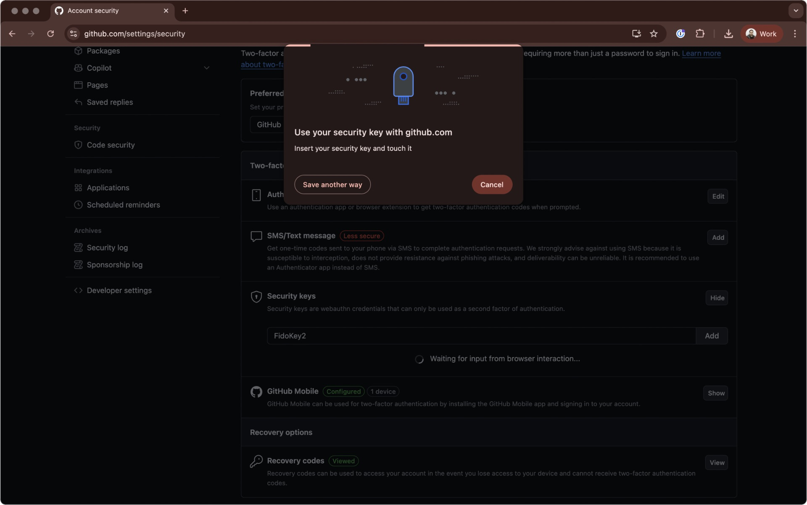
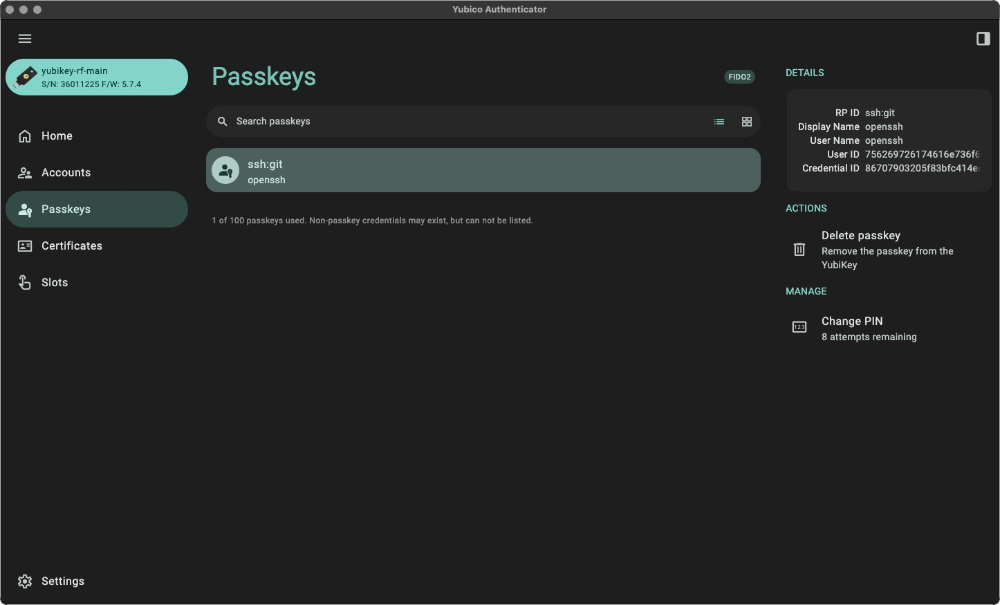

# Hardware Security Keys in the Rust Project

## Overview

### Hardware security keys in Rust Infrastructure

Hardware security keys improve security by providing unphishable
protection for sensitive systems and infrastructure. The Rust infrastructure
team officially supports hardware security keys in partnership with
[Yubico Secure it Forward] program.

Currently, the members of the following teams are eligible for this grant:

* `infra`  
* `crates.io`
* `docs.rs`  
* `release`
* `triagebot`
* `bors`

The Rust Foundation provides YubiKeys to Rust Project members who need access
to critical infrastructure systems. If you are eligible for such a grant and
would like to get the recommended YubiKeys for free, get in touch with the
[T-infra in Zulip].

## YubiKeys support in the Rust infrastructure

### Supported models

The Rust infrastructure team has validated the [Yubico Series 5 USB/NFC models]
products and officially supports the Yubico Series 5 keys for any issues a
Project member might have.

### Supported firmware versions

Based on existing [security advisories], only YubiKeys with firmware
**version v5.7.4** or newer are allowed. You can use either the `ykman`
CLI or Yubico Authenticator to [check the current firmware version] of a YubiKey.

### Recommended first steps

There are at least two official open-source tools provided by Yubico tools that
help setting up an Yubikey:

* [Yubico Authenticator] (sources : [Desktop and Android] | [iOS]):  
  * The Desktop app is pretty capable of handling most of the tasks.  
  * You can download the Mobile App directly on Google Play or Apple App Store.  
* Yubico Manager CLI (sources: [yubikey-manager]): for advanced use cases.

As a good first step, the Rust infrastructure team recommends using the Yubico
Authenticator Desktop app to change the default values for:

* The [Passkeys PIN default value reference]
* The [PIV app PIN and PUK default values reference]

For those who prefer the CLI, [uvx] might be an alternative to run the `ykman`
Python utility without installing it globally in your system or managing Python
installations. You can refer to the [ykman online documentation] to learn more
about subcommands.

```shell
➜  uvx --from yubikey-manager ykman --help
```

### Multifactor authentication with webauthn

Yubico implements the [FIDO2 standard] in all its products, and therefore,
setting up YubiKeys as a multi-factor authenticator device **should just work**
without any additional configuration for any web systems that support second
authentication factors on top of [webauthn].

As an example, to set up a YubiKey to MFA in Github, you can refer to these
[official steps]. At some point, you'll be prompted with the following dialog:



The setup flow will vary depending on the system, and might also change
according to web browser extensions you have installed (e.g. 1password,
which offers itself as an option during such a setup) but in general you
should mind the *security key* web browser dialog.

This step triggers the check for the human presence against the hardware
key. Touch your YubiKey to confirm the authentication.

Our [upcoming infrastructure policy] mandates using this option for all
compatible critical Rust Infrastructure systems.

### Hardware-backed multi factor authentication

For systems that require multi-factor authentication but only support TOTP
codes as a secure MFA method, YubiKeys can still work as an alternative to
existing solutions like Google Authenticator. In this case, you can use the
Yubico Authenticator app to set up [hardware-backed TOTP code generation].

This option provides a way to have working TOTP codes in both a mobile phone
and a desktop system without relying on third-party cloud systems, but also
has the con of coupling TOTP code generation with a physical device: similarly
to using an offline-only TOTP authenticator app, losing the Yubikey means
losing access to TOTP codes, which requires additional diligence regarding
backing up recovery codes.

Note that setting up hardware-backed TOTP codes is optional for Rust Project
members.

### Hardware-backed SSH keys

For those who want additional security for SSH authentication, YubiKeys
offer different [options for hardware-backed SSH key pairs]. Having your
SSH keys hardware-backed makes private SSH keys effortlessly portable across
different machines.

For example, if you want to use a Yubikey-backed SSH key with your Github account,
[OpenSSH built-in support for FIDO2 authentication] may be the easiest way to get
started.

The setup will differ depending on your operating system, but keep in mind that
you may also need to tweak your Git configuration to make sure that operations
like commit signing continue to work as expected. In particular, we recommend
not prompting the passkey PIN for every Git operation, since it might be
counterproductive.

As an example, this command will define a new resident SSH key through FIDO2
and won't prompt your passkey everytime, nor will it require touching the
hardware key for Git operations.

```shell
➜  ssh-keygen -t ed25519-sk \
  -O resident \
  -O application=ssh:git \
  -O no-touch-required \
  -C "me@email.com"
```

Hardware-backed SSH keys are optional for now, but might be required for certain
administrative infrastructure tasks in the future. You can check which resident
SSH keys are available in your YubiKey either with CLI or Yubico Authenticator
app.

```shell
➜  uvx --from yubikey-manager ykman fido credentials list
Enter your PIN:
Credential ID  RP ID    Username  Display name
86707903...    ssh:git  openssh   openssh

```



### PIV and attestations

YubiKeys are compatible with [Personal Identity Verification (PIV)] for smart
cards, which allows using them for encryption and signing operations on top
of this particular standard.

Some capabilities backed by PIV will be introduced later in the Rust Project.
For now, you may want to [watch this issue] to follow-up on this topic.

## FAQ

### Which services should I use 2FA with my YubiKey?

Please check our [upcoming infrastructure policy].

### How do I handle my preferred cloud CLI authentication with my YubiKey?

For Gcloud CLI, the [web-based authentication flow] will automatically prompt your
2FA method of choice, and after that, no additional steps are required. You just
need to configure it as your preferred [MFA method in your Google account].

For AWS CLI, you should stick with [AWS SSO user sessions] rather than IAM user
sessions when setting up your CLI configuration. This flow will prompt your 2FA
method when signing with your web browser of choice.

The Rust infrastructure provides SSO access to Project members through our
[AWS Identity Center configuration]. You still need to configure your YubiKey as your
[MFA method of choice in your AWS user account], though.

[Yubico Secure it Forward]: https://www.yubico.com/why-yubico/secure-it-forward
[T-infra in Zulip]: https://rust-lang.zulipchat.com/#narrow/channel/242791-t-infra
[Yubico Series 5 USB/NFC models]: https://www.yubico.com/products/yubikey-5-overview
[security advisories]: https://www.yubico.com/support/security-advisories
[check the current firmware version]: https://support.yubico.com/s/article/Where-to-find-YubiKey-firmware-details
[Yubico Authenticator]: https://www.yubico.com/products/yubico-authenticator
[Desktop and Android]: https://github.com/Yubico/yubioath-flutter
[iOS]: https://github.com/Yubico/yubioath-ios
[yubikey-manager]: https://github.com/Yubico/yubikey-manager
[Passkeys PIN default value reference]: https://support.yubico.com/s/article/Understanding-YubiKey-PINs
[PIV app PIN and PUK default values reference]: https://developers.yubico.com/PIV/Introduction/YubiKey_and_PIV.html
[uvx]: https://docs.astral.sh/uv/guides/tools
[ykman online documentation]: https://docs.yubico.com/software/yubikey/tools/ykman
[FIDO2 standard]: https://fidoalliance.org/specifications
[webauthn]: https://en.wikipedia.org/wiki/WebAuthn
[official steps]: https://docs.github.com/en/authentication/securing-your-account-with-two-factor-authentication-2fa/configuring-two-factor-authentication#configuring-two-factor-authentication-using-a-security-key
[upcoming infrastructure policy]: https://github.com/rust-lang/rust-forge/pull/1051
[hardware-backed TOTP code generation]: https://support.yubico.com/s/article/Using-your-YubiKey-with-authenticator-codes
[options for hardware-backed SSH key pairs]: https://developers.yubico.com/SSH
[OpenSSH built-in support for FIDO2 authentication]: https://developers.yubico.com/SSH/Securing_SSH_with_FIDO2.html
[Personal Identity Verification (PIV)]: https://developers.yubico.com/PIV
[watch this issue]: https://github.com/rust-lang/team/issues/2501
[web-based authentication flow]: https://docs.cloud.google.com/sdk/docs/authenticate#humans
[MFA method in your Google account]: https://support.google.com/accounts/answer/6103523?hl=en&co=GENIE.Platform%3DDesktop
[AWS SSO user sessions]: https://docs.aws.amazon.com/cli/latest/userguide/cli-configure-sso.html
[AWS Identity Center configuration]: https://forge.rust-lang.org/infra/docs/aws-access.html
[MFA method of choice in your AWS user account]: https://docs.aws.amazon.com/IAM/latest/UserGuide/id_credentials_mfa.html
